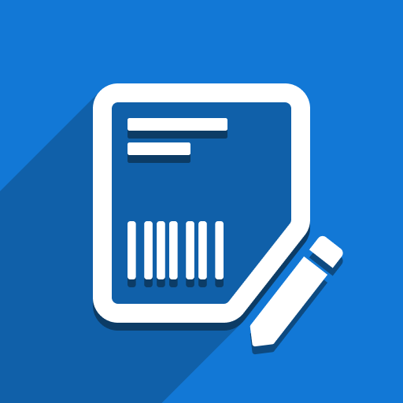
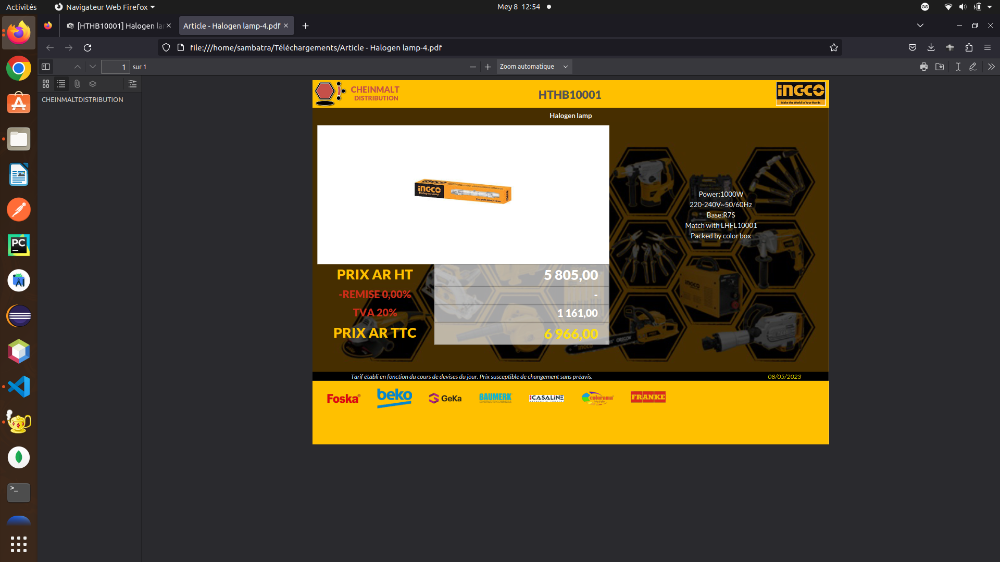

    

# Article Print Template

    <b><i>article_print_template</i></b> : A customized article print template
     
    <b><i>Author</i></b> : Sambatra-Andriamihaja

## Installation
- Add this repository inside odoo/addons (remove the assets directory)
- Go update the app list in odoo
- Install article_print_template

## Overview

    

 

    
    
    

          

